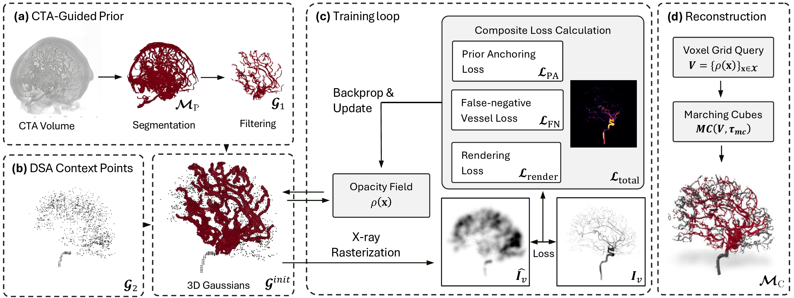

# 3D Cerebrovascular Shape Completion from Biplane Angiography and CTA Prior

## [Project Page](https://janik-j.github.io/cta-dsa-fusion/) | [Documentation](https://janik-j.github.io/cta-dsa-fusion/getting-started.html)

We propose a novel approach to bridge the resolution and dimensionality gap between CTA, which provides 3D vascular geometry but often misses small vessels, and biplanar 2D DSA, which offers higher spatial resolution but lacks 3D structural information, by formulating the problem as a 3D shape completion task. Our method represents vasculature using a set of 3D Gaussians initialized from CTA-derived vessel geometry and augmented with additional spatial and opacity primitives seeded from two DSA projections. These Gaussians jointly encode geometry and attenuation and are optimized to fit the observed DSA images while remaining consistent with the original CTA anatomy. Experiments on synthetic and clinical cerebrovascular data demonstrate improved 3D reconstruction of small vessel branches at submillimetric resolution, validating the use of DSA to complement missing CTA vessel anatomy.



## Demo

<p align="center">
  
</p>

## Quick Start

### Install

Requirements:
- Linux `x86_64`
- NVIDIA GPU
- CUDA 11.8 toolkit with `nvcc`
- `gcc` / `g++`
- `unzip`
- `uv`

Install `uv` first if it is not already available:

```bash
curl -LsSf https://astral.sh/uv/install.sh | sh
```

Then create the pinned Python environment and install the repo:

```bash
uv python install 3.10
./scripts/uv.sh sync --verify
```

If CUDA autodetection fails or your cluster uses modules / split NVHPC layouts, see the hosted
[Getting Started](https://janik-j.github.io/cta-dsa-fusion/getting-started.html) guide for the full setup and troubleshooting notes.

### Download TopBrain CTA Data

Download the CTA training release from the [TopBrain data page](https://topbrain2025.grand-challenge.org/data/) and unzip into `datasets/raw/`:

```bash
mkdir -p datasets/raw
unzip TopBrain_Data_Release_Batches1n2_081425.zip -d datasets/raw
mv datasets/raw/TopBrain_Data_Release_Batches1n2_081425/{imagesTr,labelsTr}_topbrain_ct datasets/raw/
```

### Generate Dataset

```bash
uv run python -m data_generation.topbrain.cli --batch --limit 1 \
  --output-root datasets/processed/topbrain
```

### Train (2-view reconstruction)

```bash
uv run python train.py \
  -s datasets/processed/topbrain/topcow_ct_001/views/v2_ap_lat \
  -m results/2v_experiment \
  --Nviews 2 --seed 42
```

For a shorter 2-view smoke run, stop after 10k iterations and end densification at 5k:

```bash
uv run python train.py \
  -s datasets/processed/topbrain/topcow_ct_001/views/v2_ap_lat \
  -m results/2v_experiment_10k \
  --Nviews 2 --seed 42 \
  --iterations 10000 --densify_until_iter 5000
```

### Evaluate

```bash
uv run python test.py -m results/2v_experiment --VQR --render_2d --seed 42
```

## Documentation

Start with the hosted documentation:

- [Getting Started](https://janik-j.github.io/cta-dsa-fusion/getting-started.html)
- [Clinical Data](https://janik-j.github.io/cta-dsa-fusion/clinical-data.html)
- [Dataset Schema](https://janik-j.github.io/cta-dsa-fusion/dataset-schema.html)
- [Architecture](https://janik-j.github.io/cta-dsa-fusion/architecture.html)

## Related Links

- [4DRGS](https://github.com/ShanghaiTech-IMPACT/4DRGS) — upstream Gaussian splatting framework for sparse-view DSA reconstruction
- [3DGS](https://github.com/graphdeco-inria/gaussian-splatting) — foundational 3D Gaussian Splatting
- [R<sup>2</sup>-Gaussian](https://github.com/Ruyi-Zha/r2_gaussian) — first 3DGS-based framework for CT reconstruction
- [TIGRE](https://github.com/CERN/TIGRE) — GPU-accelerated CT projection toolbox
- [tiny-cuda-nn](https://github.com/NVlabs/tiny-cuda-nn) — neural network primitives for hash-grid opacity fields
- [TopBrain](https://topbrain2025.grand-challenge.org/) — whole brain vessel segmentation challenge and CTA data source
- [xvr](https://github.com/eigenvivek/xvr) — framework for rapid patient-specific 2D/3D X-ray-to-volume registration using differentiable rendering

This codebase builds on the excellent open-source work above. Thanks for all these great projects.

## Citation

Citation metadata will be added once the paper citation is finalized.

## License

MIT License. See [LICENSE](LICENSE) for details.
